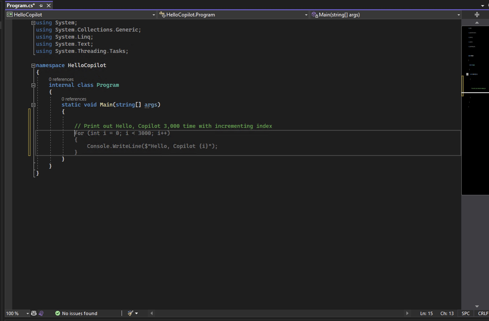
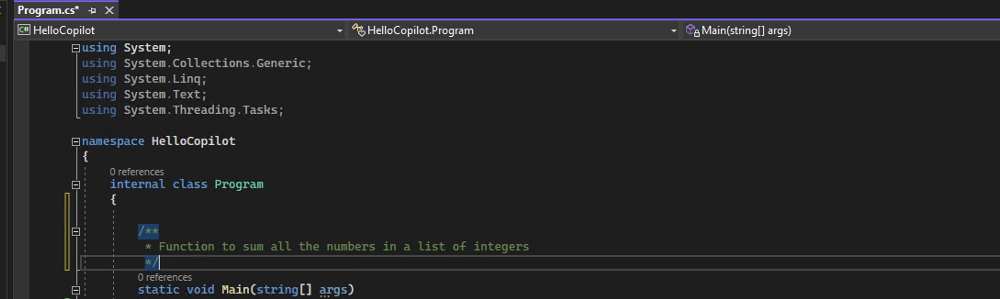
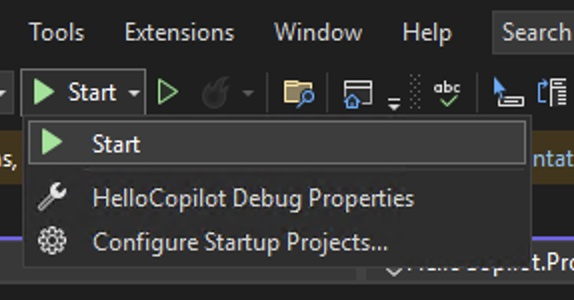
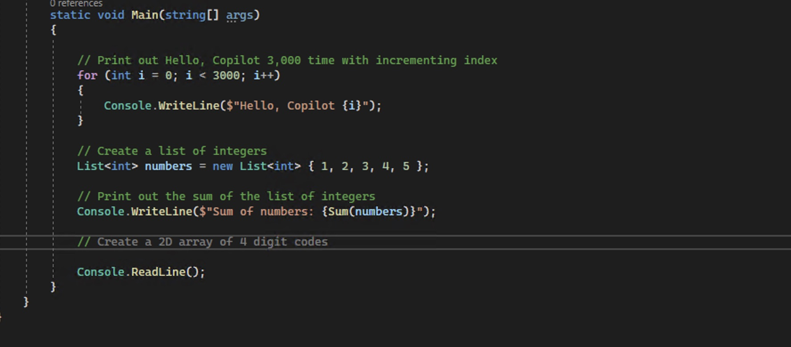

# Getting started - Visual Studio IDE

Welcome to GitHub Copilot! In this example, we'll show you how to use Copilot to write a simple .NET application.

Create a new repository in the Wigo4IT GitHub Organization. You will use this during the workshop. Make sure to set visibility to private. Then clone the repository to your local machine and start working on it using VS Code.

In your repository, create a directory called HelloCopilot. 

In the HelloCopilot application, create a new console app using the terminal command: dotnet new console --use-program-main in the location where you would like to start.


### Step 1: Write a simple code

Let's start writing some simple code first. Inside your **Main** method, create a following comment after `//`

Write the code from the below screenshot into your own file.

```csharp
// Print out Hello, Copilot 3,000 time with incrementing index
```


As soon as you enter next line, you should see that Copilot is suggesting you to write a code. 



Select the first suggestion by hitting **Tab** button.


By the way, since this is a Console App, it will be a good idea to add the following line at the end of your **Main** method.

```csharp
Console.ReadLine();
```

This can helps to keep the console window open after the program is finished.


Your file should look like this.


That is it for writing a very simple code using Copilot. We can run this code by clicking **Start** button on top, but let's actually write a function.

### Step 2: Write a function

We will add a function above the **Main** method. Let's add a following comment as a block comment.

```csharp
/*
 * Function to sum all the numbers in a list of integers
 */
```



Again, when you enter, it should show you a suggestion. Yours might look different frome mine, though.


Hit **Tab** button to select the first suggestion. Your code might look like this.


Let's proceed to add codes to run that within main function. In the Main method, start clicking anywhere and click **Enter** button to see suggestions made by Copilot.


You can keep hit **Enter** and **Tab** buttons to take suggestions, but make sure that you can stop once you are happy with the result or fix if needed.


### Step 3: Run the code

Now, let's run the code. Click **Start** button on top.


If there is a drop down, click **Start** again.



Then, you will a console window with the following output.


### Step 4: Add more complicated function

Let's add little more complicated function. Add a following comment as a block comment.

```csharp
/*
 * Function to randomly assign 4 digit codes to N x M matrix representing lockers
 */
```


Going back to Main function again, start hitting **Enter** and **Tab** buttons to take suggestions.



Sometime, you might need to enter more details result to correct.


Sometimes, you might encounter an error like this.


Although you may not get an exactly same result, this example has a problem with index because it was using `i` as an index for both `for` loops. Let's fix that by changing the second `for` loop to use `j` instead of `i`.


Remember. Copilot is not perfect, and it can make some dumb mistakes. You might need to fix the code to make it work. You are the main pilot, and Copilot is your assistance.

That is it! Congratulation on finishing your first exercise with Copilot. You can try to write more complicated code and see how Copilot can help you.
