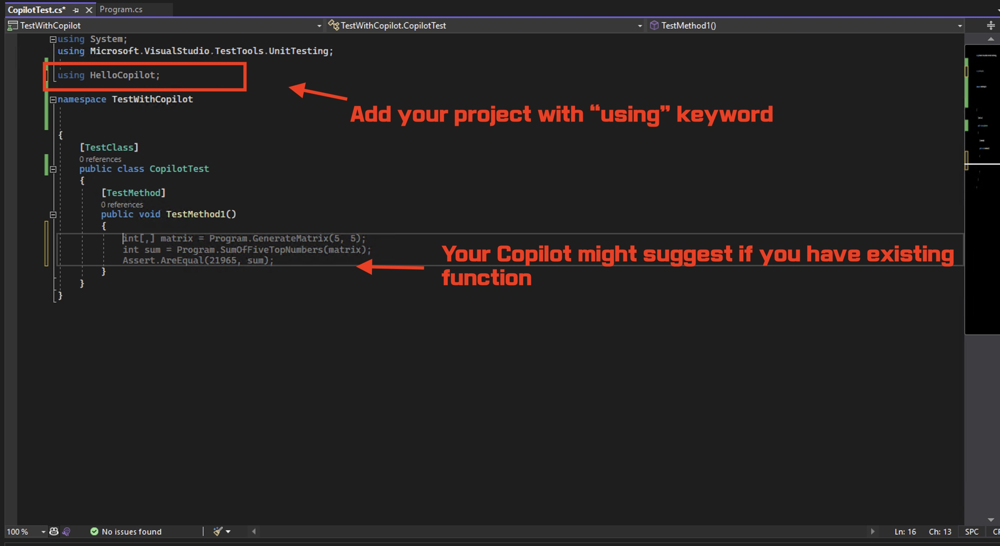
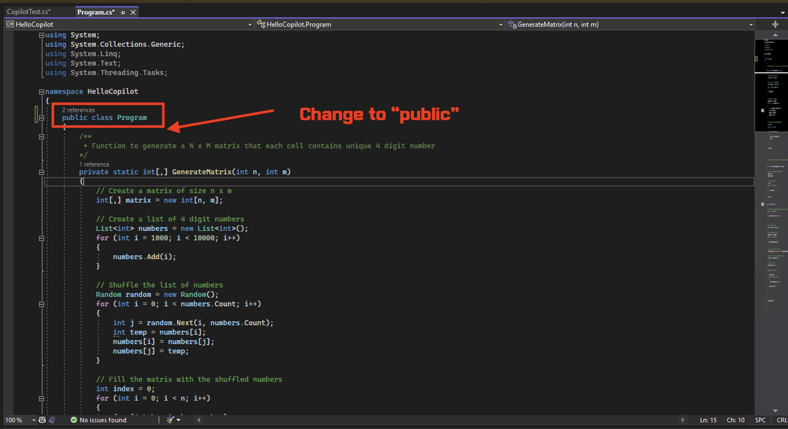
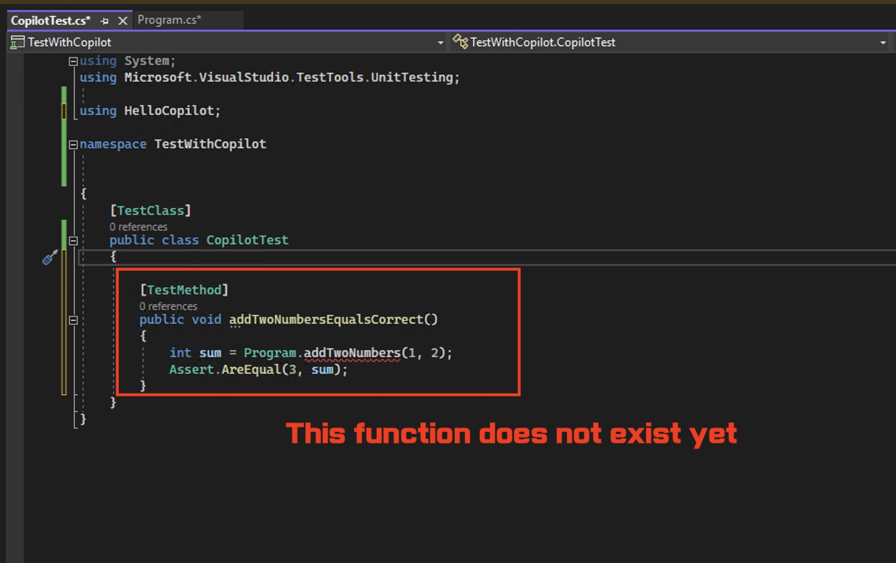
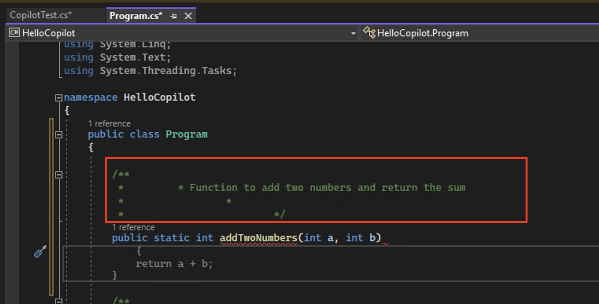
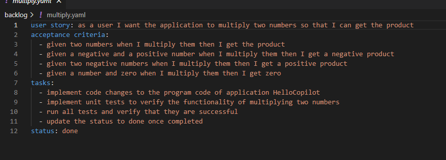
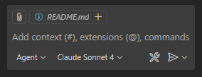
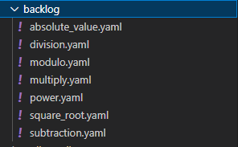

# Test Driven Development (TDD) with C# and .NET through Visual Studio IDE

**Test-Driven Development (TDD)** is a software develpment proces relying on software requirements being converted to test cases before software is fully developed. Since unit testing or any type of functional or performance testings are very important in programming development, TDD practice is very highly encouraged among C# and.NET developers. Copilot is a great tool to help C# and .NET developers to write unit tests for their C# and .NET code as it can helps to bootstrap a lot of repetitive code for unit tests.

As you can see in the picture below, TDD process involves writing tests first, see if it fails (goes to red), then write code to make the test pass (green). Copilot can help you to write the test code and you can focus on writing the code to make the test pass.

This demo is focusing around how to use Copilot to easily write unit tests for C# and .NET code. We will be using Visual Studio IDEA for this demo.

## Prerequisites

Make sure that you meet the following requirements.

- VS Code 
- GH Copilot extension installed
- Set your Copilot agent to Claude Sonnet 4 (others might also work but the below steps have been tested using Sonnet 4)

## Steps

### Step 1: Add MSTest project to GettingStarted
Next to the GettingStarted directory (so not in), create an additional directory, name it TDD. In that directory execute the following terminal command. dotnet new mstest

### Step 2: Create dependency from MSTest project to GettingStarted
Find a way to create a dependency from MSTest to GettingStarted, hint, ask Copilot Agent to help you with that.

### Step 3: Build project

Build the solution. If you dont know how, ask Copilot.

### Step 4: Getting ready to write unit test

We are finally ready to implement our unit test in TDD style. But first, add the following line in your unit testing class. You need to add your source code project namespace with `using` keyword. For example, in my example below, I added `using GettingStarted` because `GettingStarted` is my namespace for my source code project.

You will notice that it generates a sample test method. As you try to type in it, Copilot might generate some test method as you see above.

But there is one change that we definitely need to make before running this, especially if you followed previous [Getting Started](../GettingStarted/) example. In your source code class, change that visibility of class from `internal` to `public`.

Now, we are ready to write actual unit test!

### Step 5: Writing unit tests in TDD style

We could use existing method, but we will just write a new unit test from scratch. Just rename your function to something like `AddTwoNumbersEqualsCorrect`. Then, Copilot will try to generate a test method with a function that does not yet exist.

Let's go to our source code class. As you click under class, you should that Copilot will try to generate suggestion like this based on the method you added in your test class.

Let's accept that suggestion. Next, let's try to build. Click **Build** under tool bar, then select **Build Solution**.

Now build the solution dotnet build and verify you have no errors.

### Step 6: Run the tests
Ask Copilot how to run the unit test

### Step 7: Create a folder called backlog in the root of your directory
Now we are going to simualate a product backlog by creating a file for each user story.

Start with a user story for a new multiplication feature.
Create a file called multiply.yaml in the backlog directory.

Fill the content as shown below.

Then ask Copilot in Agent mode to execute the changes required as described in the multiply.yaml file.

To select agent mode, click the button on the bottom left.
 

### Step 8: Create additional functionality
Instead of thinking of new functionality ourselves, we ask Copilot for inspiration and then ask it to create the user stories for us.
Use a prompt similar to:
Think about new features that would make our calculator more feature complete. Then create user story files for each feature in the backlog directory. Use the same structure as the multiply user story. And set the status to open

You should end up with new user stories, similar to the screenshow below.

Then ask Copilot to implement all user stories with status Open. Once completed you have finished this exercise.
